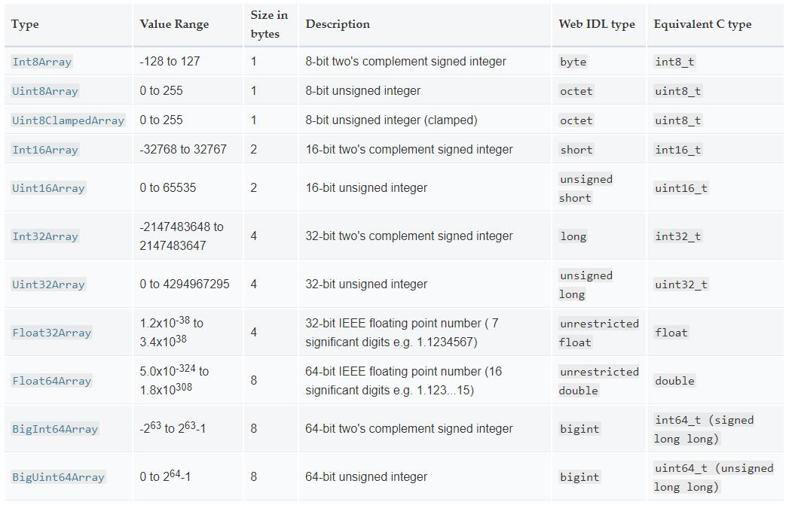

# JavaScript 数据类型和数据结构

编程语言都具有内建的数据结构，但各种编程语言的数据结构常有不同之处。本文试图列出 JavaScript 语言中内建的数据结构及其属性，它们可以用来构建其他的数据结构；同时尽可能的描述与其他语言的不同之处

## 动态类型

JavaScript 是一种弱类型或者说动态语言。这意味着你不用提前声明变量的类型，在程序运行过程中，类型会被自动确定。这也意味着你可以使用同一个变量保存不同类型的数据：

```javascript
var foo = 42;    // foo is a Number now
foo = "bar"; // foo is a String now
foo = true;  // foo is a Boolean now
```

## 数据类型

最新的 ECMAScript 标准定义了 7 种数据类型:

- 6 种原始类型:
	- Boolean
	- Null
	- Undefined
	- Number
	- String
	- Symbol (ECMAScript 6 新定义)
- 和 Object

## 原始值( primitive values )

除 Object 以外的所有类型都是不可变的（值本身无法被改变）。例如，与 C 语言不同，JavaScript 中字符串是不可变的（译注：如，JavaScript 中对字符串的操作一定返回了一个新字符串，原始字符串并没有被改变）。我们称这些类型的值为“原始值”。

### 布尔类型

布尔表示一个逻辑实体，可以有两个值：true 和 false。

### Null 类型节

Null 类型只有一个值： null，更多详情可查看 null 和 Null 。

### Undefined 类型节

一个没有被赋值的变量会有个默认值 undefined，更多详情可查看 undefined 和 Undefined。

### 数字类型节

根据 ECMAScript 标准，JavaScript 中只有一种数字类型：基于 IEEE 754 标准的双精度 64 位二进制格式的值（-(263 -1) 到 263 -1）。它并没有为整数给出一种特定的类型。除了能够表示浮点数外，还有一些带符号的值：+Infinity，-Infinity 和 NaN (非数值，Not-a-Number)。

要检查值是否大于或小于 +/-Infinity，你可以使用常量 Number.MAX_VALUE 和 Number.MIN_VALUE。另外在 ECMAScript 6 中，你也可以通过 Number.isSafeInteger() 方法还有 Number.MAX_SAFE_INTEGER 和 Number.MIN_SAFE_INTEGER 来检查值是否在双精度浮点数的取值范围内。 超出这个范围，JavaScript 中的数字不再安全了，也就是只有 second mathematical interger 可以在 JavaScript 数字类型中正确表现。

数字类型只有一个整数，它有两种表示方法： 0 可表示为 -0 和 +0（"0" 是 +0 的简写）。 在实践中，这也几乎没有影响。 例如 +0 === -0 为真。 但是，你可能要注意除以0的时候：

```javascript
42 / +0; // Infinity
42 / -0; // -Infinity
```

尽管一个数字常常仅代表它本身的值，但JavaScript提供了一些位运算符。 这些位运算符和一个单一数字通过位操作可以用来表现一些布尔值。然而自从 JavaScript 提供其他的方式来表示一组布尔值（如一个布尔值数组或一个布尔值分配给命名属性的对象）后，这种方式通常被认为是不好的。位操作也容易使代码难以阅读，理解和维护， 在一些非常受限的情况下，可能需要用到这些技术，比如试图应付本地存储的存储限制。 位操作只应该是用来优化尺寸的最后选择。

### 字符串类型

JavaScript的字符串类型用于表示文本数据。它是一组16位的无符号整数值的“元素”。在字符串中的每个元素占据了字符串的位置。第一个元素的索引为0，下一个是索引1，依此类推。字符串的长度是它的元素的数量。

不同于类 C 语言，JavaScript 字符串是不可更改的。这意味着字符串一旦被创建，就不能被修改。但是，可以基于对原始字符串的操作来创建新的字符串。例如：

- 获取一个字符串的子串可通过选择个别字母或者使用 String.substr().
- 两个字符串的连接使用连接操作符 (+) 或者 String.concat().

### 注意代码中的“字符串类型”！

可以使用字符串来表达复杂的数据。以下是一些很好的性质：

- 容易连接构造复杂的字串符
- 字符串容易被调试(你看到的往往在字符串里)
- 字符串通常是许多APIs的常见标准 (input fields, local storage values, XMLHttpRequest当使用responseText等的时候回应) 而且他只能与字符串一同使用。

按照惯例, 字符串一般可以用来表达任何数据结构。这不是一个好主意。例如，使用一个分隔符，一个可以模仿一个列表(一个JavaScript的数组可能更适合一些) 。不幸的是，当一个分隔符在用于列表中的元素时，打乱了这个列表。 一个转义字符等。所有这些惯例都变成了一个不存在的维护负担而没有正确的工具使用。

表达文本数据和符号数据时候推荐使用字符串。当表达复杂的数据时，使用字符串解析和适当的缩写。

### 符号类型

符号(Symbols)是ECMAScript 第6版新定义的。符号类型是唯一的并且是不可修改的, 并且也可以用来作为Object的key的值(如下). 在某些语言当中也有类似的原子类型(Atoms). 你也可以认为为它们是C里面的枚举类型. 更多细节请看 Symbol 和 Symbol 。

## 对象

在计算机科学中, 对象是指内存中的可以被 标识符引用的一块区域.

### 属性

在 Javascript 里，对象可以被看作是一组属性的集合。用对象字面量语法来定义一个对象时，会自动初始化一组属性。（也就是说，你定义一个var a = "Hello"，那么a本身就会有a.substring这个方法，以及a.length这个属性，以及其它；如果你定义了一个对象，var a = {}，那么a就会自动有a.hasOwnProperty及a.constructor等属性和方法。）而后，这些属性还可以被增减。属性的值可以是任意类型，包括具有复杂数据结构的对象。属性使用键来标识，它的键值可以是一个字符串或者符号值（Symbol）。

ECMAScript定义的对象中有两种属性：数据属性和访问器属性。

#### 数据属性

数据属性是键值对，并且每个数据属性拥有下列特性:

- 数据属性的特性(Attributes of a data property)

|特性|数据类型|描述|默认值|
|-|-|-|-|
|[[Value]]|任何Javascript类型|包含这个属性的数据值。|undefined|
|[[Writable]]|Boolean|如果该值为 false，则该属性的 [[Value]] 特性 不能被改变。|true|
|[[Enumerable]]|Boolean|如果该值为 true，则该属性可以用 for...in 循环来枚举。|true|
|[[Configurable]]|Boolean|如果该值为 false，则该属性不能被删除，并且 除了 [[Value]] 和 [[Writable]] 以外的特性都不能被改变。|true|

- 过时的属性(在ECMAScript 3定义的, 在ECMAScript 5被重命名)

|属性|类型|描述|
|-|-|-|
|Read-only|Boolean|ES5 [[Writable]]|属性的反状态(Reversed state)|
|DontEnum|Boolean|ES5 [[Enumerable]]|属性的反状态|
|DontDelete|Boolean|ES5 [[Configurable]]|属性的反状态|

#### 访问器属性

访问器属性有一个或两个访问器函数 (get 和 set) 来存取数值，并且有以下特性:

- 一个访问器属性的特性

|特性|类型|描述|默认值|
|-|-|-|-|
|[[Get]]|函数对象或者 undefined|该函数使用一个空的参数列表，能够在有权访问的情况下读取属性值。另见 get。|undefined|
|[[Set]]|函数对象或者 undefined|该函数有一个参数，用来写入属性值，另见 set。|undefined|
|[[Enumerable]]|Boolean|如果该值为 true，则该属性可以用 for...in 循环来枚举。|true|
|[[Configurable]]|Boolean|如果该值为 false，则该属性不能被删除，并且不能被转变成一个数据属性。|true|

> 注意：这些特性只有 JavaScript 引擎才用到，因此你不能直接访问它们。所以特性被放在两对方括号中，而不是一对。

### "标准的" 对象, 和函数

一个 Javascript 对象就是键和值之间的映射.。键是一个字符串（或者 Symbol） ，值可以是任意类型的值。 这使得对象非常符合 哈希表。

函数是一个附带可被调用功能的常规对象。

### 日期

当你想要显示日期时，毋庸置疑，使用内建的 Date 对象。

### 有序集: 数组和类型数组

数组是一种使用整数作为键(integer-key-ed)属性和长度(length)属性之间关联的常规对象。此外，数组对象还继承了 Array.prototype 的一些操作数组的便捷方法。例如, indexOf (搜索数组中的一个值) or push (向数组中添加一个元素)，等等。 这使得数组是表示列表或集合的最优选择。

类型数组(Typed Arrays)是ECMAScript Edition 6中新定义的 JavaScript 内建对象，提供了一个基本的二进制数据缓冲区的类数组视图。下面的表格能帮助你找到对等的 C 语言数据类型：

#### TypedArray objects



### 键控集: Maps, Sets, WeakMaps, WeakSets

这些数据结构把对象的引用当作键，其在ECMAScript第6版中有介绍。当 Map 和 WeakMap 把一个值和对象关联起来的时候， Set 和 WeakSet 表示一组对象。 Map和WeakMaps之间的差别在于，在前者中，对象键是可枚举的。这允许垃圾收集器优化后面的枚举(This allows garbage collection optimizations in the latter case)。

在纯ECMAScript 5下可以实现Maps和Sets。然而，因为对象并不能进行比较（就对象“小于”示例来讲），所以查询必定是线性的。他们本地实现（包括WeakMaps）查询所花费的时间可能是对数增长。

通常，可以通过直接在对象上设置属性或着使用`data-*`属性，来绑定数据到DOM节点。然而缺陷是在任何的脚本里，数据都运行在同样的上下文中。Maps和WeakMaps方便将数据私密的绑定到一个对象。 

### 结构化数据: JSON

JSON (JavaScript Object Notation) 是一种轻量级的数据交换格式，来源于 JavaScript 同时也被多种语言所使用。 JSON 用于构建通用的数据结构。参见 JSON 以及 JSON 了解更多。

### 标准库中更多的对象

JavaScript 有一个内置对象的标准库。请查看参考来了解更多对象。

## 使用 typeof 操作符判断对象类型

typeof 运算符可以帮助你查询变量的类型。要了解更多细节和注意事项请阅读参考页。

## 规范

|规范|状态|注释|
|-|-|-|
|ECMAScript 1st Edition (ECMA-262)|Standard|初始定义|
|ECMAScript 5.1 (ECMA-262)|Standard||
|ECMAScript 2015 (6th Edition, ECMA-262)|Standard||

**本文转载自 MDN web docs，<a href="https://developer.mozilla.org/zh-CN/docs/Web/JavaScript/Data_structures" rel="nofollow">《JavaScript 数据类型和数据结构》</a>**